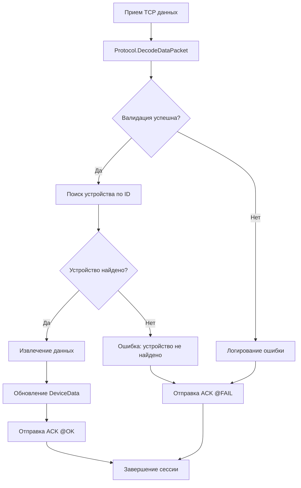

# Детальный анализ архитектуры DrvAnemon

## Архитектурные паттерны

### 1. Архитектурные слои
```
┌─────────────────┐
│   View Layer    │ ← DrvAnemon.View (Пользовательский интерфейс)
│   (Presentation)│   - Конфигурация устройств
└─────────────────┘   - Прототипы каналов
         │
┌─────────────────┐
│   Logic Layer   │ ← DrvAnemon.Logic (Бизнес-логика)
│   (Business)    │   - Обработка протокола
└─────────────────┘   - Управление устройствами
         │
┌─────────────────┐
│   Protocol      │ ← Protocol.cs (Парсинг данных)
│   Layer         │   - Декодирование пакетов
└─────────────────┘   - Валидация данных
```

### 2. Паттерн Factory Method
- `CnlPrototypeFactory` - создание прототипов каналов
- `DriverView.CreateDeviceView()` - создание представлений устройств

### 3. Паттерн Strategy
- Различные версии протокола (1 и 2)
- Гибкая система парсинга данных

## Анализ протокола обмена данными

### Формат пакета
```
#id:DEVICE123;datetime:20241201123456;live:1;t1:25.5;t2:30.1;t3:0#
```

### Компоненты протокола:
1. **Разделители**: `#` - начало/конец пакета, `;` - разделитель полей
2. **Поля данных**:
   - `id:` - идентификатор устройства
   - `datetime:` - дата и время в формате yyyyMMddHHmmss (UTC)
   - `live:` - флаг актуальности данных (1/0)
   - `t{number}:` - значение сенсора

### Алгоритм декодирования:
1. Валидация границ пакета
2. Разделение на поля по `;`
3. Парсинг каждого поля по формату `name:value`
4. Обработка специальных случаев для сенсоров
5. Создание структуры DataPacket

### Обработка ошибок:
- Некорректные форматы даты/времени
- Невалидные номера сенсоров (1-256)
- Некорректные значения измерений
- Отсутствие обязательных полей

## Поток обработки данных



## Система тегов и каналов

### Индексы тегов:
- `0` - PacketReceived (количество принятых пакетов)
- `1` - PacketFailed (количество потерянных пакетов)
- `2` - DateTime (дата и время последнего обновления)
- `3+` - Sensors (t1-t256, значения сенсоров)

### Группы каналов:
1. **Связь** - мониторинг статистики соединения
2. **Контроллер** - системная информация
3. **Текущие данные** - 256 каналов для сенсоров

## Управление состоянием устройства

### Статусы устройства:
- `0` - Disconnected (не подключено)
- `1` - Normal (нормальная работа)
- `2` - Error (ошибка)

### Жизненный цикл данных:
- `DataLifetime` - время актуальности данных (по умолчанию 600 сек)
- Автоматическая инвалидация устаревших данных
- Логирование переходов состояний

## Интеграция с RapidScada

### Интерфейсы:
- `DriverLogic` - базовый класс драйвера
- `DeviceLogic` - логика работы с устройством
- `DriverView` - пользовательский интерфейс
- `DeviceView` - интерфейс устройства

### Конфигурация:
- Пользовательские параметры линии связи
- Строковый адрес устройства (ID контроллера)
- Настройки опроса (timeout, polling interval)
